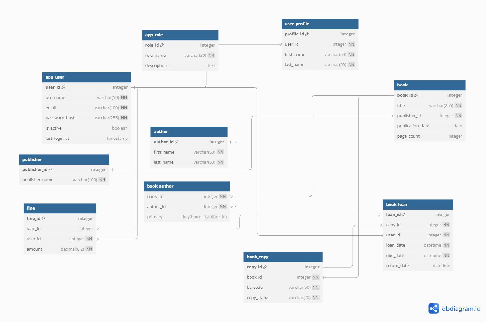

# Library Management System - Database Schema

## Overview
This repository contains a comprehensive, production-grade database schema for a modern Library Management System. Designed by database professionals, this schema implements industry best practices for security, performance, and maintainability.

## Key Features

### Core Functionality
- **User Management**: Role-based access control with hierarchical permissions
- **Catalog Management**: Complete bibliographic control with support for:
  - Multiple identifiers
  - Complex author relationships
  - Hierarchical subject classification
- **Inventory Control**: Physical copy tracking with status management
- **Circulation**: Configurable loan policies with renewal support
- **Financials**: Fine assessment and tracking

### Technical Highlights
- **Security**: 
  - Password hashing support
  - Failed login tracking
  - Comprehensive audit logging
- **Performance**:
  - Strategic indexing
  - Full-text search capabilities
  - Partition-ready design
- **Maintainability**:
  - Standardized naming conventions
  - Complete documentation
  - Versioned schema changes

## Schema Documentation

### Entity Relationship Diagram


### Table Reference
| Table | Description | Key Relationships |
|-------|------------|-------------------|
| `app_user` | User authentication | `user_profile`, `book_loan` |
| `book` | Bibliographic records | `publisher`, `book_author` |
| `book_copy` | Physical inventory | `book`, `book_loan` |
| `book_loan` | Circulation transactions | `book_copy`, `app_user` |


## Installation

### Prerequisites
- MySQL 8.0+ or compatible RDBMS
- 2GB+ storage (depending on collection size)
- UTF-8 character encoding support

### Deployment
1. Create the database:
   ```sql
   CREATE DATABASE library_management 
     CHARACTER SET utf8mb4 
     COLLATE utf8mb4_unicode_ci;
   ```

2. Initialize schema:
   ```bash
   mysql -u [username] -p library_management < schema/01_core_tables.sql
   mysql -u [username] -p library_management < schema/02_reference_data.sql
   ```

3. Verify installation:
   ```sql
   SHOW TABLES;
   SELECT COUNT(*) FROM app_role; -- Should return 3
   ```

## Configuration

### Environment Variables
```ini
DB_HOST=localhost
DB_PORT=3306
DB_NAME=library_management
DB_USER=libadmin
DB_PASSWORD=secure_password
```

### Recommended Server Settings
```ini
[mysqld]
innodb_buffer_pool_size=1G
innodb_log_file_size=256M
max_connections=200
```

## Usage Examples

### Common Queries
**Active Loans Report:**
```sql
SELECT u.username, b.title, bl.due_date
FROM book_loan bl
JOIN app_user u ON bl.user_id = u.user_id
JOIN book_copy bc ON bl.copy_id = bc.copy_id
JOIN book b ON bc.book_id = b.book_id
WHERE bl.loan_status = 'ACTIVE';
```

**Catalog Search:**
```sql
SELECT book_id, title FROM book
WHERE MATCH(title, subtitle) AGAINST('database design' IN NATURAL LANGUAGE MODE);
```

## Maintenance

### Backup Procedure
```bash
mysqldump -u [username] -p library_management > backup/$(date +%F)_full_backup.sql
```

### Index Optimization
```sql
ANALYZE TABLE book_loan;
OPTIMIZE TABLE book_copy;
```


## Contributing
1. Fork the repository
2. Create a feature branch (`git checkout -b feature/improvement`)
3. Commit changes (`git commit -am 'Add some feature'`)
4. Push to branch (`git push origin feature/improvement`)
5. Open a Pull Request

## License
MIT License. See [LICENSE](LICENSE) for full text.

## Support
For issues or questions, please open a GitHub Issue or contact:
- Database Architect: [DANIEL MUTUA] (dannydophlix@.com)